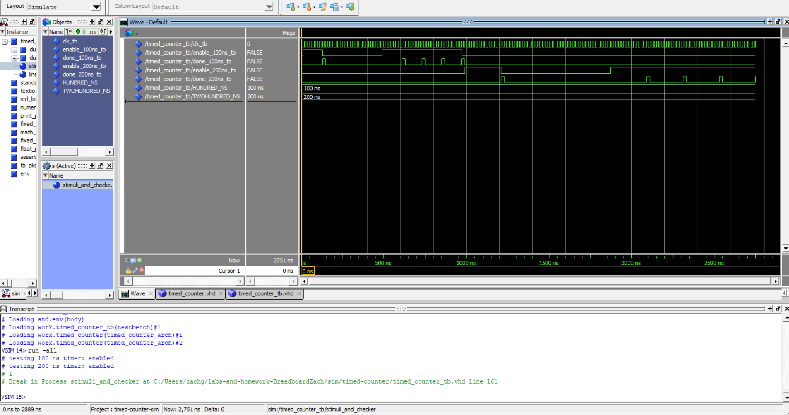

# Home Work 4: Timed Counter

## Overview
This homework we wrote a test bench and vhd code based on a skeleton that asserted done after a certain ammount of cycles based off an enable.

## Deliverables
<Transcript_and_Waveform>
