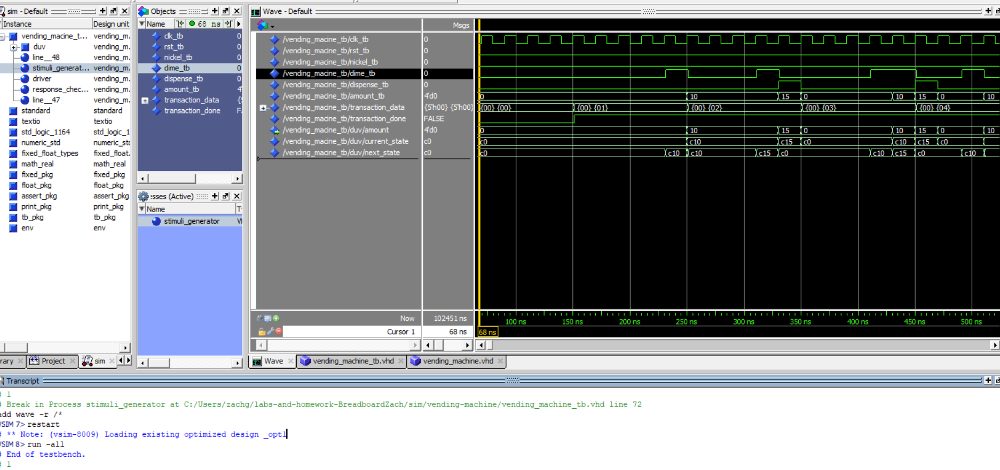

# Home Work 5: Vending Machine

## Overview
In this homework, we wrote a vhdl code that used state logic in order to operate a vending machine that uses dimes and nickels. We were instructed to, based on coin input, move to the next state and dispense a coin ammount.

## Deliverables
<Transcript_and_Waveform>