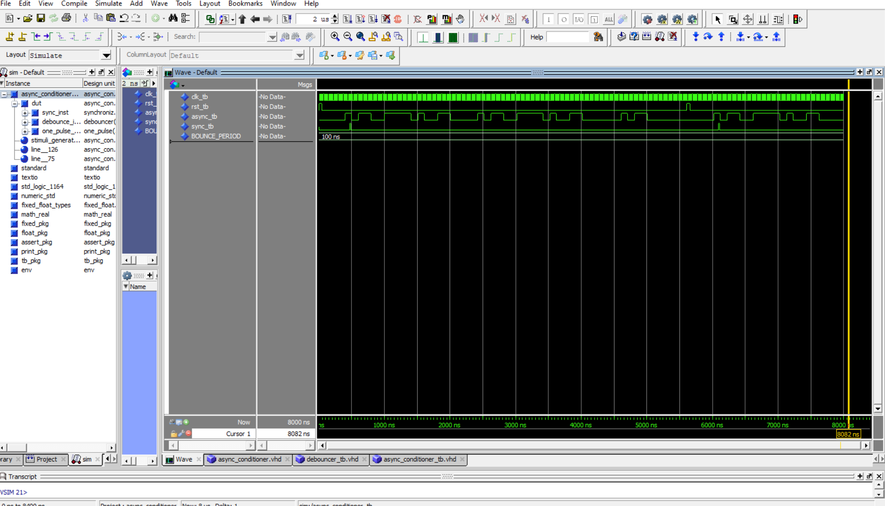

# Home Work 6: Async Conditioner

## Overview
In this homework, we wrote a vhdl code that used multiple components to create an asyncronous conditioner. This code included a synchronizer, debouncer, and one pulse components to instantiate the conditioner. The asyncronous conditioner allows for asynchronous inputs to interact with synchronous systems.

### Deliverable 1: Debouncer
This waveform shows a debouncer ignoring inputs after the initial button press allowing for a cleaner switching charecteritic.
<Transcript_and_Waveform>

### Deliverable 2: One Pulse
This wafeform demonstrates the one pulse using 3 test cases. The first test case is after 2 clock cycles, the second after 2 more cycles, and lastly after 5 clock cycles.
<Transcript_and_Waveform>

### Deliverable 3: Async Conditioner
My test bench was not ideal but demonstrated that all components worked when an asynchronous input was sent. All components still interacted properly ending with a one pulse output that was located at equal to the ammount of clock cycles each component took added, behind the input pulse.
<Transcript_and_Waveform>

### Comments
I was very confused with a lot of the test bench writing and was wondering if we could either be provided less intense examples or have a lecture on how to write them. This homework did improve my ability to write them but I still feel like I am in the dark.
