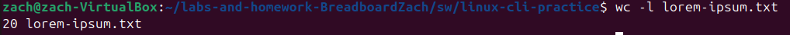

# Homework 7: Linux Commands

## Problem 1
### Deliverables
 `wc -w lorem-ipsum.txt`
 <Q1>

## Problem 2 
### Deliverables
`wc -m  lorem-ipsum.txt`
 <Q2>

## Problem 3 
### Deliverables
`wc -m  lorem-ipsum.txt`
 <Q3>

## Problem 4 
### Deliverables
`sort -h file-sizes.txt`
 <Q4>

## Problem 5 
### Deliverables
`sort -rh file-sizes.txt`
 <Q5>

## Problem 6 
### Deliverables
`cut -d',' -f3 log.csv`
 <Q6>

## Problem 7
### Deliverables
`cut -d',' -f2,3 log.csv`
 <Q7>

## Problem 8
### Deliverables
`cut -d',' -f1,4 log.csv`
 <Q8>

## Problem 9
### Deliverables
`head -n 3 gibberish.txt`
 <Q9>

## Problem 10
### Deliverables
`tail -n 3 gibberish.txt`
 <Q10>

## Problem 11
### Deliverables
`tail -n 20 log.csv`
 <Q11>

## Problem 12 
### Deliverables
`dmesg | grep "and" gibberish.txt` or `grep "and" gibberish.txt`
 <Q12>

## Problem 13 
### Deliverables
`dmesg | grep -w -n "we" gibberish.txt` or `grep -w -n "we" gibberish.txt`
 <Q13>

## Problem 14 
### Deliverables
`grep -i -o -P "to\s\w+" gibberish.txt`
 <Q14>

## Problem 15 
### Deliverables
`grep -c "FPGAs" fpgas.txt`
 <Q15>

## Proble, 16
### Deliverables
`grep -i -P "(hot|not|cower|tower|smile|compile)" fpgas.txt`
 <Q16>

## Problem 17
### Deliverables
`grep -r -E "^\s*--" --include="*.vhd" ../../hdl/ | cut -d: -f1 | sort | uniq -c | awk '{print $2 ":" $1}'`
 <Q17>

## Problem 18
### Deliverables
`ls > ls-output.txt && cat ls-output.txt`
 <Q18>

## Problem 19
### Deliverables
`sudo dmesg | grep "CPU topo"`
 <Q19>

## Problem 20
### Deliverables
`find ../../hdl/ -iname '*.vhd' | wc -l`
 <Q20>

## Problem 21
### Deliverables
`grep -r --include="*.vhd" "^\s*--" ../../hdl/ | wc -l`
 <Q21>

## Problem 22
### Deliverables
`grep -n "FPGAs" fpgas.txt | cut -d: -f1`
 <Q22>

## Problem 23
### Deliverables
`du -h ../../* | sort -hr | head -n 3`
 <Q23>
