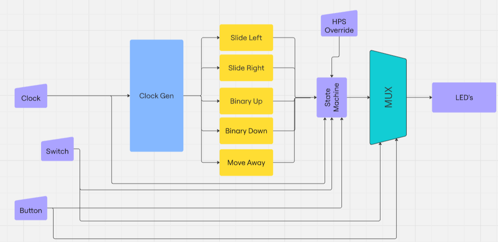

# Lab 4 Report: LED Patterns

## 1. Project Overview
  In this lab we were asked to create a Quartus project for the DE-10 Nano. This project should include a state machine that will chose from a set of patterns based on a series of button presses and flipped switches.

## 2. Functional Requirements/Architecture
 Below in figure 1 is the architecture used described with a block diagram.

 <FinalBlockDiagram>

### 2.1 Clock Generator
  The clock generator is in charge of taking care of all clockdiv's or multipliers.

  - **Clockdiv1_sec**: Clock at a rate of 1 second
  - **Clockdiv2**: Clock Divided by 2
  - **Clockdiv4**: Clock Divided by 4
  - **Clockdiv8**: Clock divided by 8
  - **Clock2**: Clock multiplie by 2

### 2.2. HPS_LED_control Signal
- **Control Switch**: The `HPS_LED_control` signal determines who manages the LEDs.
  - **HPS_LED_control = 1**: LEDs are controlled by software running on the ARM HPS, which writes to a register (`LED_reg`).
  - **HPS_LED_control = 0**: LEDs are managed by a state machine implemented in the `LED_Patterns` component within the FPGA fabric.

### 2.3. LED State Machine
When the `HPS_LED_control` signal is set to 0, the control of the LEDs is transferred to the state machine in the FPGA. The state machine implements five states with specific LED patterns that run at various rates relative to the base rate (`Base_rate`). The states are defined as follows:

1. **State 0**: Default reset or power-up state.
   - **Pattern**: LEDs[6:0] display a single lit LED shifting right circularly at a rate of `1/2 * Base_rate` seconds.

2. **State 1**: Left-shifting pattern.
   - **Pattern**: LEDs[6:0] display two adjacent lit LEDs shifting left circularly at a rate of `1/4 * Base_rate` seconds.

3. **State 2**: 7-bit Up Counter.
   - **Pattern**: LEDs[6:0] display the output of a 7-bit up counter running at a rate of `2 * Base_rate` seconds, which wraps around when it reaches its maximum value.

4. **State 3**: 7-bit Down Counter.
   - **Pattern**: LEDs[6:0] display the output of a 7-bit down counter running at a rate of `1/8 * Base_rate` seconds, which also wraps around upon reaching zero.

5. **State 4 (User Design)**: Light Split.
   - **Pattern**: LEDs[6:0] display a 2 leds starting in the middle of the display and walk outwards from eachother at a rate of "1 * base_rate"

Below is the state diagram used in my design.
<FinalBlockDiagram>

### 2.4. LED7 (LEDs[7]) Behavior
- **LED7** must blink at a consistent rate of `1 * Base_rate` seconds.

### 2.5. State Transitions via Push-Button
State transitions are triggered by the push-button (PB) input. The transition process follows these steps:

- **Sequence 1**: Upon pressing the push button, the binary value of the switches (SW) is displayed on LEDs[6:0] for a duration of 1 second. During this time, no other LED patterns are shown.
  
- **Sequence 2**: After displaying the switch value, the state machine checks the binary value of the switches (SW). If the value represents a state from 0 to 4, the state machine transitions to that state. If the value represents a state greater than 4, the state remains unchanged, but the switch value is still displayed for 1 second.

- **Sequence 3**: After the 1-second display of the switch value, the state machine executes the LED pattern corresponding to the new state (if changed) or remains in the current state (if unchanged).

### 2.6 MUX 
 The mux is used to determine the LED output based on the Switches, this is integrated into the state machine.

