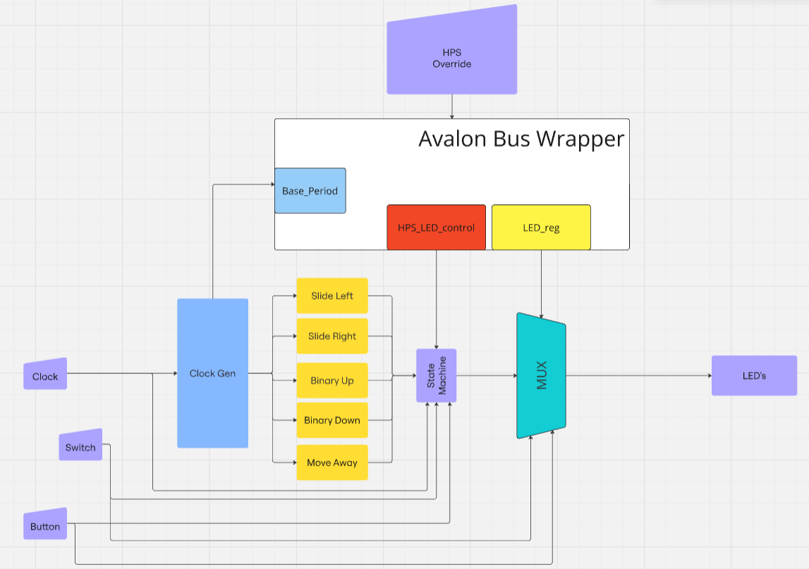

# Lab 6 : Platform Designer

## System Architecture

### Updated Block Diagram
<BD>

My architectue includes the avalon bus wrapper which diverts some signals that drives the registers
I created. The base period takes whatever clock I need generateed from the clock gen and allows the
HPS and LED_reg to work properly. This architecture did not change the funtionality at all but changed
how the program is driven/controlled. Below is a more in depth picture of how reading and writing flow works.

### Read/Write Wave diagram
<WR>

## Register Map
The way my registers work is that there is a "readdata" bus and a "writedata" bus that the information
is put into. It works on a call and return basis where some process needs to call the 
specific address before it can be used. When called it will then continue with that section of the code changing 
any bit data needed.

<WDHPS>

<WDBase>

<WDLED>

### Address Map
|       Name      | Address |
| --------------- | ------- |
| HPS_LED_control | 0x00    |
| Base_Period     |   0x01  |
|     LED_reg     | 0x10    |

## Questions

• How did you connect these registers to the ARM CPUs in the HPS?

     -Using the lightweight bus system

• What is the base address of your component in your Platform Designer system?

    -0x0000_0000 - 0x0000_000f